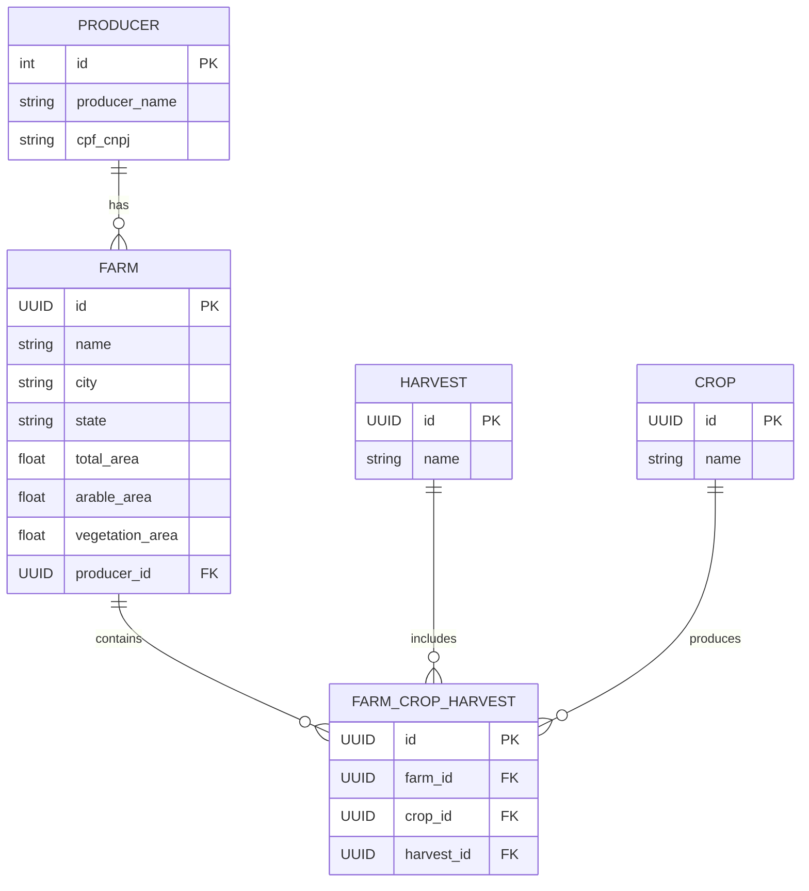

## 🧩 Diagrama de Entidades (ERD)

```mermaid
erDiagram
  PRODUCER ||--o{ FARM : has
  FARM ||--o{ FARM_CROP_HARVEST : contains
  HARVEST ||--o{ FARM_CROP_HARVEST : includes
  CROP ||--o{ FARM_CROP_HARVEST : produces

  PRODUCER {
    int id PK
    string producer_name
    string cpf_cnpj
  }

  FARM {
    UUID id PK
    string name
    string city
    string state
    float total_area
    float arable_area
    float vegetation_area
    UUID producer_id FK
  }

  HARVEST {
    UUID id PK
    string name
  }

  CROP {
    UUID id PK
    string name
  }

  FARM_CROP_HARVEST {
    UUID id PK
    UUID farm_id FK
    UUID crop_id FK
    UUID harvest_id FK
  }
```
