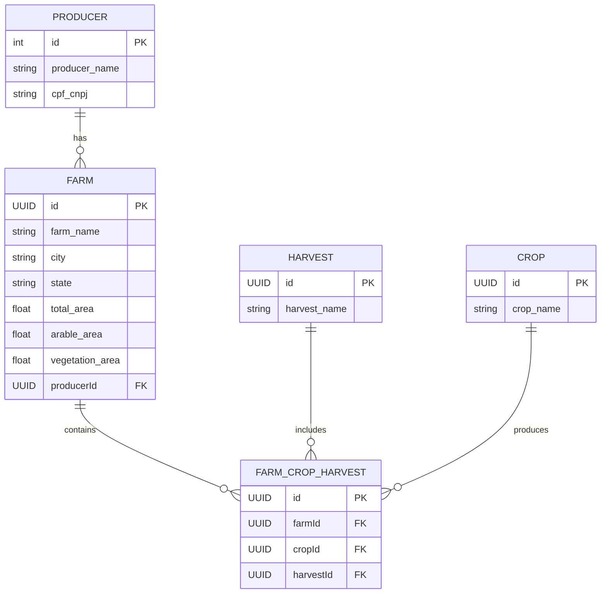

# API Brain Agriculture

## Visão Geral

A **API Brain Agriculture** é um serviço backend projetado para gerenciar dados agrícolas, incluindo produtores, fazendas, culturas e colheitas. Construída com tecnologias modernas, oferece uma solução robusta e escalável para rastreamento e análise de atividades agrícolas, com foco em usabilidade e manutenibilidade.

## Arquitetura

A API segue uma arquitetura modular e em camadas, utilizando **NestJS**, um framework progressivo para Node.js, combinado com **TypeORM** para operações no banco de dados e **PostgreSQL** como banco de dados relacional.

## 🧩 Diagrama de Entidades (ERD)

### Componentes Principais

- **Framework**: NestJS

  - Utiliza injeção de dependências, estrutura modular e TypeScript para facilitar a manutenção.
  - Organizada em módulos (`Producer`, `Farm`, `Harvest`, `Crop`, `FarmCropHarvest`, `Dashboard`) para separação de responsabilidades.
  - Expõe endpoints RESTful com documentação OpenAPI (Swagger) disponível em `/api`.

- **Banco de Dados**: PostgreSQL com TypeORM

  - Gerencia entidades (`Producer`, `Farm`, `Harvest`, `Crop`, `FarmCropHarvest`) com UUIDs (via extensão `uuid-ossp`).
  - Usa migrações para manter a consistência do esquema entre ambientes.
  - Suporta seeding para popular dados iniciais (e.g., produtores e fazendas de exemplo).
  - Configurado com SSL para conexões seguras em produção.

- **Implantação**: Railway com Docker
  - Implantada como uma aplicação conteinerizada usando um `Dockerfile` multiestágio (Node.js 22 Alpine).
  - Hospedada na Railway, com uma instância gerenciada de PostgreSQL para persistência de dados.
  - Variáveis de ambiente (e.g., `DATABASE_URL`) configuram conexões de banco de dados de forma segura.
  - Migrações são executados automaticamente na inicialização do contêiner.

### Fluxo de Dados

1. Requisições HTTP chegam aos controladores do NestJS, que validam entradas e delegam às serviços.
2. Os serviços interagem com repositórios TypeORM para realizar operações CRUD no PostgreSQL.
3. O módulo `Dashboard` agrega dados para insights analíticos (e.g., métricas de fazendas e colheitas).
4. Respostas são formatadas como JSON, seguindo o esquema OpenAPI.

## Principais Funcionalidades

- **API REST**: Fornece endpoints para gerenciar entidades agrícolas (e.g., `/producers`, `/farms`, `/dashboard`).
- **Documentação Swagger**: Documentação interativa da API em `/api` para desenvolvedores.
- **Migrações de Banco de Dados**: Garante atualizações consistentes do esquema com migrações TypeORM.
- **Seeding**: Popula dados iniciais para testes e desenvolvimento.
- **Implantação Escalável**: Executa na Railway com escalabilidade automática e PostgreSQL gerenciado.

## Configuração e Implantação

### Link para onde está hospedada na Railway

[brainagriculture-production.up.railway.app](https://brainagriculture-production.up.railway.app/api/)

### Pré-requisitos

- Node.js 22
- Docker

### Variáveis de Ambiente

Configure nas variáveis do serviço em um arquivo `.env` local seguindo modelo `.env.example`:

- DATABASE_URL=<endereço do banco de dados **PostgreSQL**>

## Docker

Para rodar o container utilize: `docker-compose -f docker-compose.dev.yml up`

## Testes

Para rodar os testes utilize o comando:
`npm run test`
